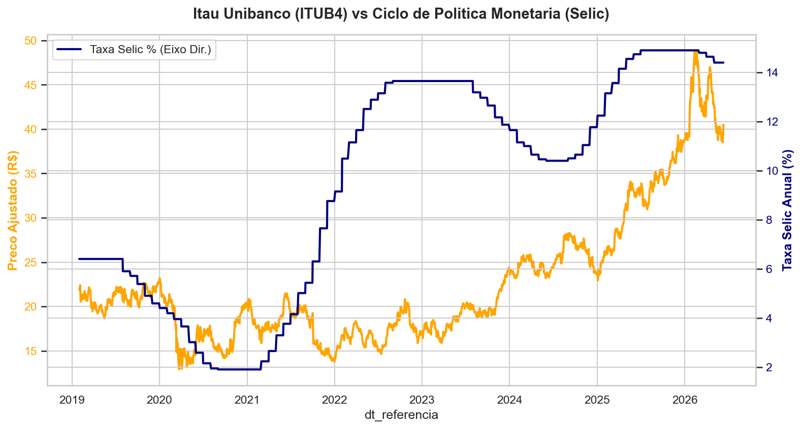
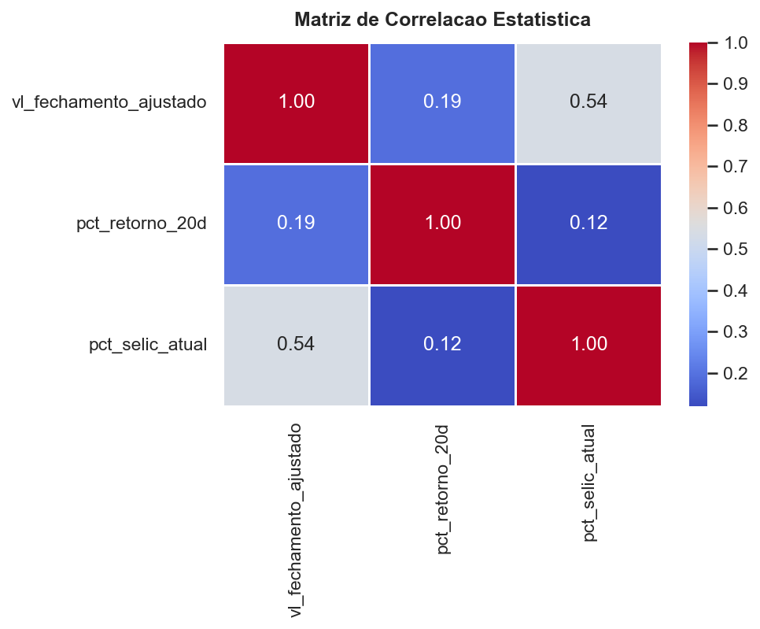

# Pipeline de Dados Quantitativos: Impacto Macroeconômico no Setor Bancário (ITUB4)

Este projeto constrói um pipeline de dados ponta a ponta (End-to-End) para extrair, armazenar, modelar e analisar o impacto histórico da Taxa Selic sobre o preço de fechamento ajustado das ações do Itaú Unibanco (ITUB4).

## 🛠️ Arquitetura e Tecnologias
- **Linguagem:** Python 3.x
- **Ingestão de Dados:** APIs oficiais do Banco Central do Brasil (SGS) e Yahoo Finance (`yfinance`)
- **Armazenamento:** Banco de Dados Relacional Local (SQLite)
- **Transformação de Dados:** SQL Avançado (CTEs e Window Functions)
- **Análise & Gráficos:** Pandas, Seaborn e Matplotlib

## 📈 Status do Progresso
- [x] **Passo 1:** Ingestão automatizada de dados brutos e carga na camada de Staging do SQLite.
- [x] **Passo 2:** Modelagem de Dados com SQL (Alinhamento temporal e cálculo de lags).
- [x] **Passo 3:** Análise Estatística e Visualização de Dados (Python).
- [ ] **Passo 4:** Relatório de Insights Econômicos e Documentação Final.

## 📊 Visualizações Geradas

### Histórico de Ativos vs Macroeconomia


### Matriz de Correlação Linear


## 🚀 Como Executar
```bash
# 1. Ingestão
python scripts/ingestao_dados.py
# 2. Modelagem SQL
python scripts/modelagem_dados.py
# 3. Análise e Gráficos
python scripts/analise_graficos.py