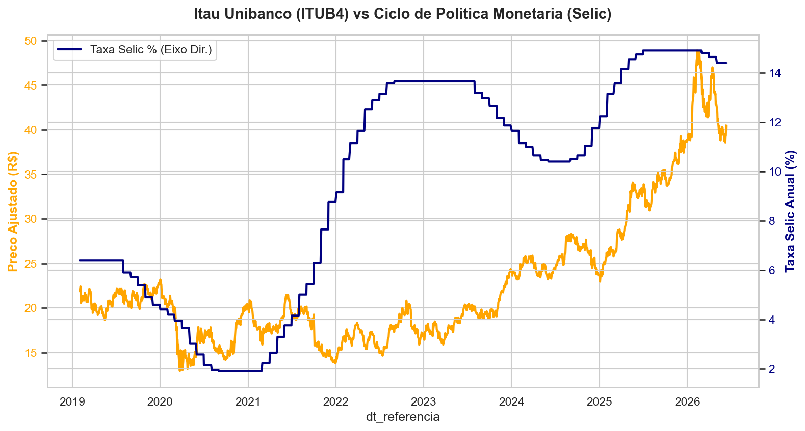
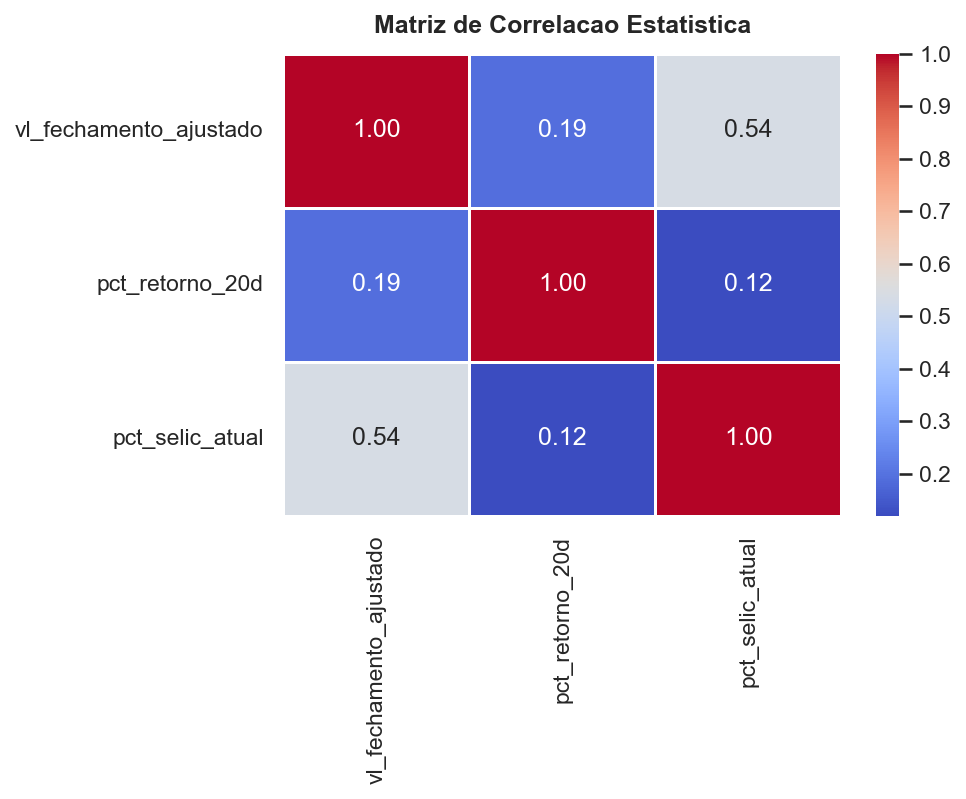
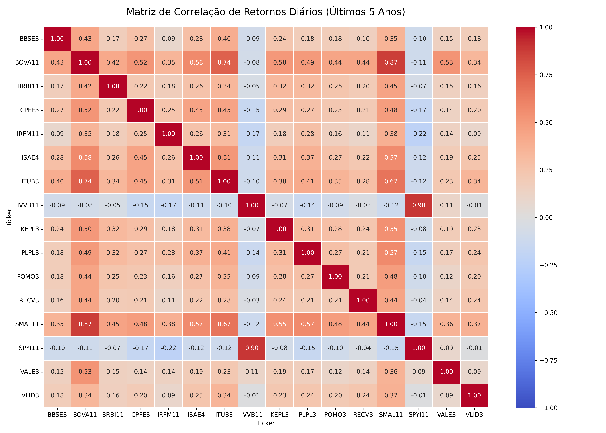
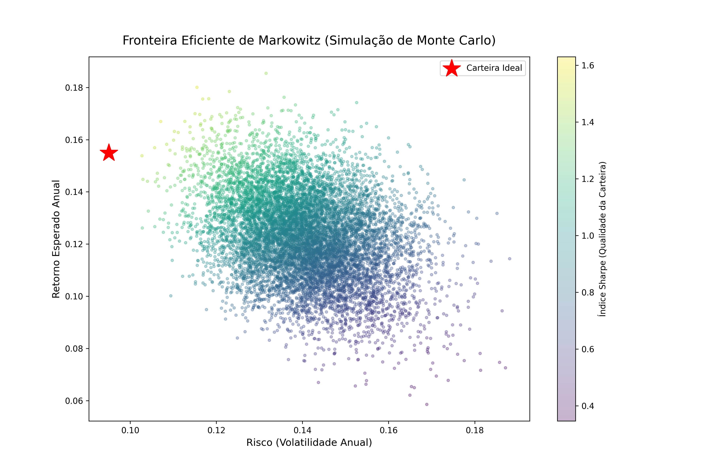
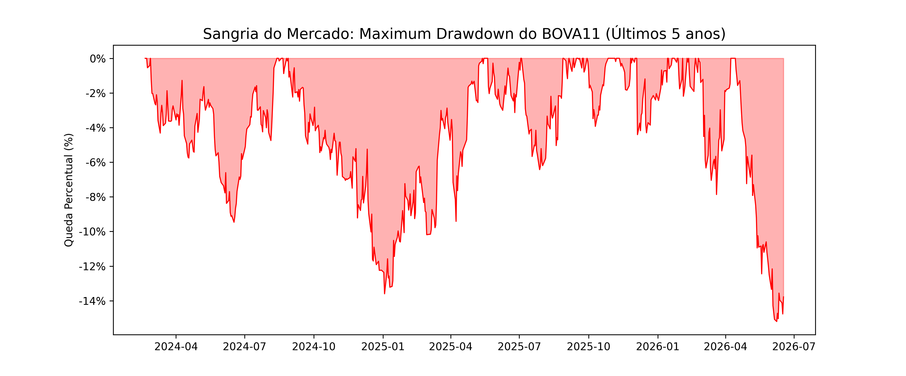
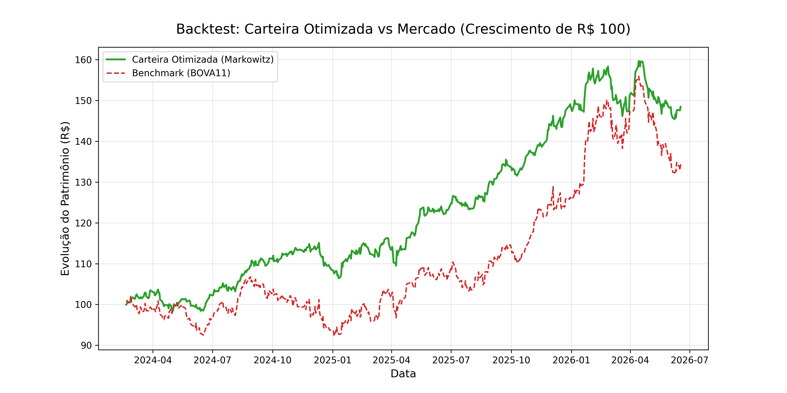

# 📈 Motor Quantitativo: Análise Macroeconômica, Otimização de Portfólio e Risco Sistêmico

Este repositório abriga um ecossistema de inteligência quantitativa ponta a ponta (End-to-End). O projeto realiza a extração de dados macroeconômicos oficiais e cotações históricas, modela bancos de dados relacionais locais e aplica simulações estatísticas avançadas para otimização de portfólios e gestão de risco com padrão institucional.

## 🛠️ Arquitetura e Tecnologias

* **Linguagem:** Python 3.x
* **Engenharia de Dados & Analytics Engineering:** SQL Avançado (CTEs e Window Functions), Pandas e SQLite (Camadas de Staging, Modelagem Temporal e Tabelas Fato).
* **Ingestão de Dados:** APIs oficiais do Banco Central do Brasil (SGS) e Yahoo Finance (`yfinance`).
* **Matemática Quantitativa:** NumPy e Scikit-Learn (Simulação de Monte Carlo, Teoria Moderna do Portfólio de Markowitz, VaR Histórico e Maximum Drawdown).
* **Visualização Web (Data Product):** Streamlit.
* **Governança:** Git/GitHub com Conventional Commits e gestão estrita de segredos e credenciais (`.env`).

## 📈 Status do Progresso

- [x] **Módulo 1 (Macro & Stock-Picking):** Ingestão automatizada da Taxa Selic e ações do Itaú Unibanco (ITUB4), com alinhamento de granularidades temporais distintas (Diário vs Mensal) via banco de dados relacional.
- [x] **Módulo 2 (Multi-Asset Core):** Pipeline de ingestão, limpeza e padronização *Tidy Data* para uma carteira diversificada de 16 ativos.
- [x] **Módulo 3 (Asset Allocation):** Otimização estatística de portfólio via Simulação de Monte Carlo para mapeamento da Fronteira Eficiente.
- [x] **Módulo 4 (Risk Management):** Motor de risco extremo com cálculo matemático de Value at Risk (VaR 95%) e Maximum Drawdown histórico.
- [x] **Módulo 5 (Backtesting Engine):** Validação histórica em "máquina do tempo" comparando o retorno acumulado do algoritmo contra o Ibovespa (BOVA11).
- [x] **Módulo 6 (Data Product):** Desenvolvimento e publicação local de um Dashboard Web Interativo e dinâmico.

## 📊 Resultados e Visualizações Geradas

O ecossistema provou matematicamente a eficiência da diversificação estratégica e a geração de *Alpha* real em relação ao mercado.

### 1. Macroeconomia e Resiliência Bancária
Análise do comportamento do retorno móvel de 20 dias úteis do Itaú Unibanco frente aos ciclos de política monetária restritiva (Selic).


### 2. Matrizes de Correlação Linear
Identificação de forças e direções de co-movimentação entre os retornos diários dos ativos para estruturação de diversificação real.
* **Matriz Isolada (ITUB4 vs Macro):**

* **Matriz Expandida (Carteira Alvo):**


### 3. A Fronteira Eficiente de Markowitz
Geração de 10.000 portfólios simulados. A estrela vermelha destaca a combinação exata de pesos que maximiza o prêmio de risco pelo Índice Sharpe.


### 4. Estresse de Mercado e Risco Extremo
Mapeamento da "sangria" histórica e perdas potenciais máximas do benchmark.


### 5. O Veredito: Backtest Histórico (Últimos 5 Anos)
A carteira otimizada pela Inteligência Artificial superou o rendimento acumulado do Ibovespa (BOVA11), entregando **+45.09%** de rentabilidade contra **+34.47%** do mercado.


## 🚀 Como Executar

### 1. Governança e Segurança
Crie o arquivo de variáveis de ambiente para garantir que nenhuma chave privada ou configuração local seja exposta:
```bash
touch .env